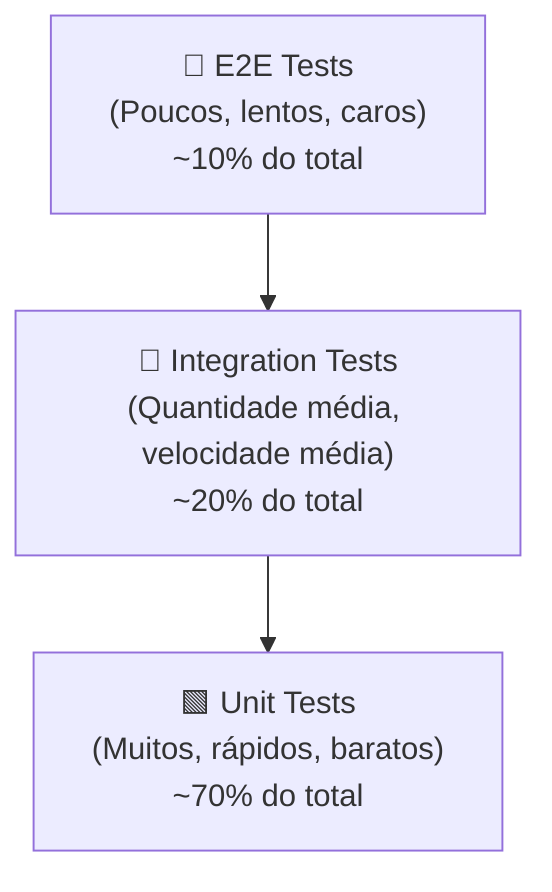
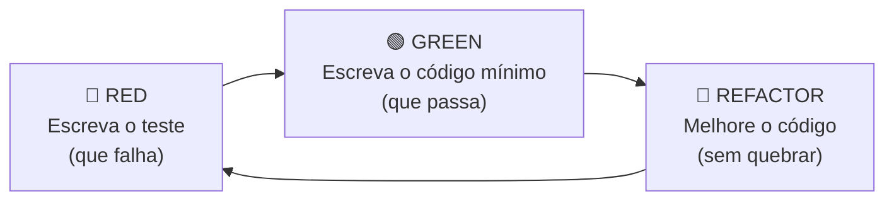
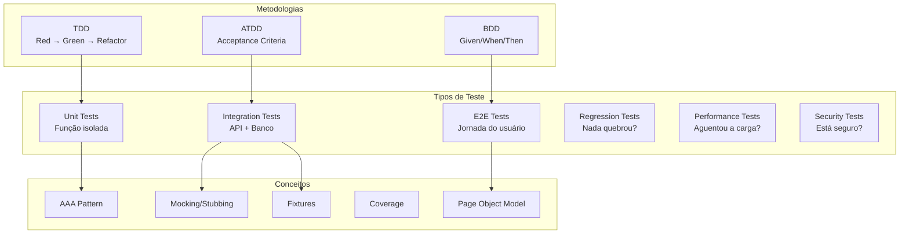

# 🧪 Software Testing: Guia Completo de Tipos, Conceitos e Metodologias

## 1. Por Que Testar Software?

Software sem testes é como um foguete sem sistema de segurança — funciona até explodir. Em projetos regulados como o MMT (multas da ANP chegam a R$1.2M), testes não são opcionais; são **controle de qualidade industrial**.

> [!IMPORTANT]
> **Regra de Ouro**: O custo de corrigir um bug cresce **exponencialmente** conforme ele avança no pipeline: Desenvolvimento (1x) → QA (10x) → Staging (100x) → Produção (1000x).

---

## 2. A Pirâmide de Testes

A base conceitual mais importante de testing moderno. Criada por Mike Cohn (2009):



| Camada | Velocidade | Custo | Confiabilidade | Quantidade |
|---|---|---|---|---|
| **Unit** | ⚡ Milissegundos | 💰 Baixo | 🎯 Alta (isolado) | 70% |
| **Integration** | 🕐 Segundos | 💰💰 Médio | 🎯🎯 Alta (conectado) | 20% |
| **E2E** | 🐢 Minutos | 💰💰💰 Alto | ⚠️ Pode ser flaky | 10% |

---

## 3. Tipos de Teste — Explicação Detalhada

### 3.1 🟩 Testes Unitários (Unit Tests)

**O que é:** Testa uma **única função ou classe** isoladamente, sem dependências externas (banco de dados, APIs, filesystem).

**Conceito-chave:** *Isolamento total*. Se o teste precisa de um banco de dados para rodar, **não é unitário**.

**Quando usar:**
- Validar lógica matemática pura
- Testar regras de negócio
- Verificar transformações de dados
- Garantir edge cases (limites, zeros, nulos)

**Exemplo do MMT M3** — Validação O2 ([test_m3_validation_engine.py](file:///home/marcosgnr/MMT/backend/tests/test_m3_validation_engine.py)):
```python
def test_o2_just_above_limit(self):
    """O2 > 0.5% DEVE reprovar — regra da ANP."""
    check = _check_o2_limit(0.501)
    assert check.status == "fail"
```

**Ferramentas:** pytest (Python), Jest/Vitest (JS/TS), JUnit (Java)

---

### 3.2 🔷 Testes de Integração (Integration Tests)

**O que é:** Testa a **comunicação entre componentes** — API + banco, serviço + serviço, frontend + backend.

**Conceito-chave:** *Contrato real*. Verifica que duas ou mais peças do sistema conversam corretamente.

**Quando usar:**
- Validar endpoints REST/GraphQL
- Testar queries no banco de dados
- Verificar middlewares de autenticação
- Testar cascata de status (sample → disembark → lab → report)

**Exemplo do MMT M3** — Ciclo de vida via API ([test_m3_api_integration.py](file:///home/marcosgnr/MMT/backend/tests/test_m3_api_integration.py)):
```python
def test_sample_to_disembark_sets_sla_dates(self, client):
    """Ao coletar, o backend DEVE calcular as datas SLA."""
    s_id = self._setup_sample(client)
    res = self._update_status(client, s_id, "DISEMBARK_PREP",
                              event_date=date.today().isoformat())
    assert res.json()["disembark_expected_date"] == (
        date.today() + timedelta(days=10)
    ).isoformat()
```

**Técnica importante:** *Banco em memória (SQLite)* — simula o PostgreSQL sem conectar ao Supabase real. Veja nosso [conftest.py](file:///home/marcosgnr/MMT/backend/tests/conftest.py).

**Ferramentas:** TestClient (FastAPI), Supertest (Node), requests (Python)

---

### 3.3 🔺 Testes End-to-End (E2E Tests)

**O que é:** Testa a **jornada completa do usuário** — do clique no botão até o resultado na tela, passando por toda a stack (browser → frontend → API → banco → resposta).

**Conceito-chave:** *Comportamento do usuário*. Simula um humano usando a aplicação.

**Quando usar:**
- Fluxos críticos (login, checkout, upload de laudo)
- Verificar renderização visual
- Testar responsividade mobile
- Validar acessibilidade

**Exemplo do MMT M3** — Kanban rendering ([m3_lifecycle.spec.ts](file:///home/marcosgnr/MMT/frontend/tests/e2e/m3_lifecycle.spec.ts)):
```typescript
test('Deve renderizar os 5 painéis do pipeline M3', async ({ page }) => {
    const dashboard = new M3DashboardPage(page);
    await dashboard.goto();
    await expect(dashboard.planSampleColumn).toBeVisible({ timeout: 10000 });
    await expect(dashboard.disembarkColumn).toBeVisible();
});
```

**Ferramentas:** Playwright (recomendado), Cypress, Selenium

> [!TIP]
> **Regra do E2E**: Nunca use `waitForTimeout(2000)`. Use auto-wait do Playwright: `await expect(element).toBeVisible()`. Isso é o que a skill `browser-automation` ensina.

---

### 3.4 🧩 Outros Tipos Importantes

#### Testes de Regressão
**O que é:** Re-executar testes existentes após uma mudança no código para garantir que nada quebrou.
**No MMT:** Toda vez que alguém alterar a `sla_matrix.py`, os 24 testes unitários de SLA vão bloquear se algum valor mudar.

#### Testes de Smoke (Sanity Check)
**O que é:** Testes rápidos e superficiais para verificar se o build "não pegou fogo". Executados primeiro no CI.
**Exemplo:** "A API responde 200 no `/health`? O login renderiza o formulário?"

#### Testes de Performance / Carga
**O que é:** Mede tempo de resposta, throughput e uso de recursos sob carga.
**Ferramentas:** Locust (Python), k6, JMeter, Artillery

#### Testes de Segurança (SAST/DAST)
**O que é:** Procura vulnerabilidades: injeção SQL, XSS, CSRF, token leaks.
**No MMT:** O Security Specialist usa `burp-suite-testing` e `vulnerability-scanner`.

#### Testes de Contrato (Contract Testing)
**O que é:** Verifica que Frontend e Backend concordam no formato do JSON (schema).
**Ferramentas:** Pact, Schemathesis

#### Testes de Mutação (Mutation Testing)
**O que é:** Modifica automaticamente o código-fonte e verifica se os testes detectam a mutação.
**Conceito:** Se você mudar `>` para `>=` e nenhum teste falhar, sua cobertura é *falsa*.
**Ferramentas:** mutmut (Python), Stryker (JS)

#### Visual Regression Testing
**O que é:** Compara screenshots pixel-a-pixel para detectar mudanças visuais acidentais.
**Ferramentas:** Playwright `toHaveScreenshot()`, Percy, Chromatic

---

## 4. Metodologias de Teste

### 4.1 TDD — Test-Driven Development



**O ciclo:**
1. **RED**: Escreva um teste que descreve o comportamento desejado. Rode — ele DEVE falhar.
2. **GREEN**: Escreva o código mais simples possível para fazer o teste passar.
3. **REFACTOR**: Limpe o código mantendo o teste verde.

**Por que funciona:** Força você a pensar na API/interface ANTES da implementação. O design do código emerge dos testes, não o contrário.

**No MMT:** O QA/TDD Specialist escreve os testes de O2 e 2-Sigma ANTES do Backend Specialist implementar o `validation_engine.py`.

---

### 4.2 BDD — Behavior-Driven Development

**O que é:** Extensão do TDD que usa linguagem natural (Given/When/Then) para descrever comportamentos.

```gherkin
Feature: M3 SLA Alert
  Scenario: Sample overdue triggers alert
    Given a sample collected 16 days ago
    And no lab report has been uploaded
    When the system runs the daily SLA check
    Then an alert should be created for the manager
    And no duplicate alerts should exist
```

**Ferramentas:** Behave (Python), Cucumber (JS/Java)

---

### 4.3 ATDD — Acceptance Test-Driven Development

**O que é:** Testes escritos ANTES do desenvolvimento, baseados em critérios de aceitação do cliente.

**No MMT:** Os SLA limits (30 dias Fiscal, 180 dias Operational) são critérios de aceitação da SBM. Nossos testes unitários de SLA são, na prática, ATDD.

---

## 5. Conceitos Fundamentais

### AAA Pattern (Arrange-Act-Assert)
Toda função de teste segue esta estrutura:
```python
def test_algo():
    # ARRANGE — prepara os dados
    sample = create_sample(type="Chromatography")
    
    # ACT — executa a ação
    result = validate_o2(sample, o2_value=0.6)
    
    # ASSERT — verifica o resultado
    assert result.status == "fail"
```

### Mocking & Stubbing
- **Mock**: Simula um objeto complexo (ex: banco de dados) para isolar o teste
- **Stub**: Retorna um valor fixo (ex: sempre retorna `{"status": "ok"}`)
- **Spy**: Observa se uma função foi chamada e com quais argumentos

### Fixtures
Funções de setup/teardown que preparam e limpam dados para testes:
```python
@pytest.fixture
def client():
    Base.metadata.create_all(bind=engine)
    with TestClient(app) as c:
        yield c        # <- teste roda aqui
    Base.metadata.drop_all(bind=engine)  # cleanup
```

### Coverage (Cobertura)
Mede qual percentual de linhas/branches do código é executado pelos testes.
- **≥80%** — Bom para projetos normais
- **≥95%** — Obrigatório para sistemas regulados (como o MMT)
- **100%** — Utópico, mas almejável para módulos críticos

> [!CAUTION]
> **Cobertura alta ≠ qualidade alta.** Você pode ter 100% de cobertura com asserts fracos (`assert True`). O que importa é a **qualidade das assertions**.

### Flaky Tests
Testes que às vezes passam e às vezes falham sem mudança de código. Causas:
- `waitForTimeout()` em vez de auto-wait
- Dependência de ordem entre testes
- Dados compartilhados entre testes
- Timezone/locale do servidor

---

## 6. Como o M3 Aplica Tudo Isso

| Conceito | Onde no M3 | Arquivo |
|---|---|---|
| Pirâmide (Unit) | SLA Matrix, O2 limit, 2-sigma, PDF parser | `test_m3_sla.py`, `test_m3_validation_engine.py`, `test_m3_pdf_parser.py` |
| Pirâmide (Integration) | API lifecycle, alerts, status flow | `test_m3_api_integration.py`, `test_m3_alerts.py` |
| Pirâmide (E2E) | Kanban, modals, responsive | `m3_lifecycle.spec.ts`, `m3_modals.spec.ts` |
| TDD (Red-Green) | Testes escritos ANTES do código | QA/TDD Specialist workflow |
| Mocking | SQLite in-memory + auth bypass | `conftest.py` |
| Factory Pattern | `SamplePointFactory`, `SampleFactory` | `conftest.py` |
| POM (Page Object) | `LoginPage`, `M3DashboardPage` | `tests/e2e/pages/` |
| Network Mocking | API 500 error handling test | `m3_lifecycle.spec.ts` |
| Accessibility | Label audit, input audit | `m3_modals.spec.ts` |

---

## 7. Resumo Visual


